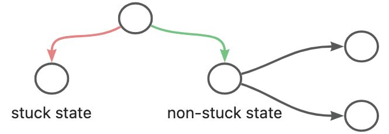
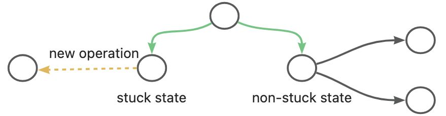

# 23/03/21
1. no operation (stuck)
   1. avoid no operation state

      1. tie breaking
      2. even don't insert no operation states (what if all states are no operation ones)
   2. add more operations

      1. critical move sat literals in clause whose sat count >= 2
      2. current random sample
      3. cad two level
      4. apply nlsat to give a candidate assignment
2. equational cases
   1. equational simplift
   2. find all equational cases
   3. linear equational:
      1. represent a linear var using other vars, R_propagate

