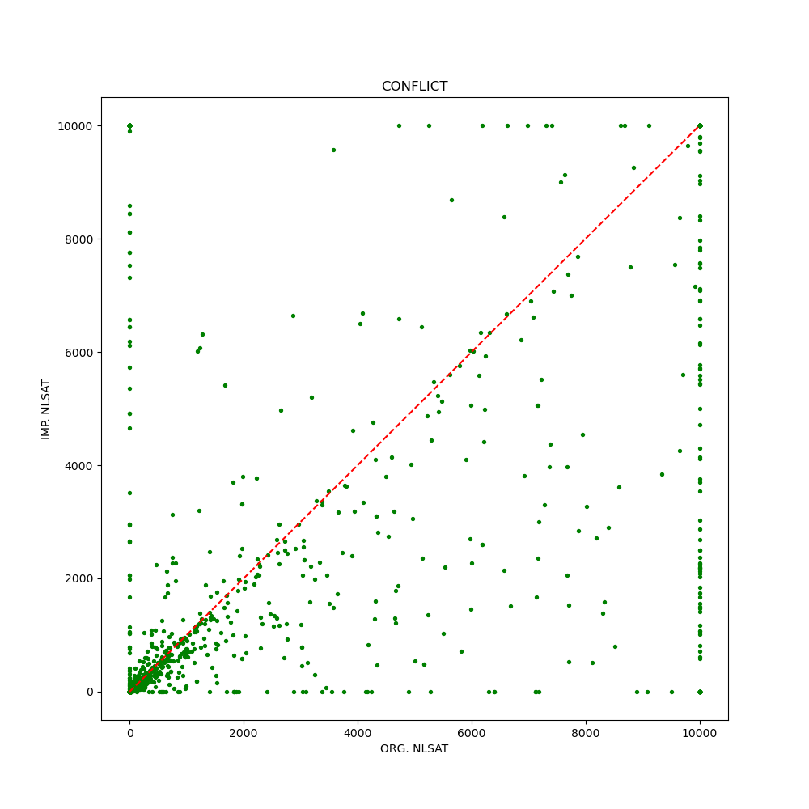
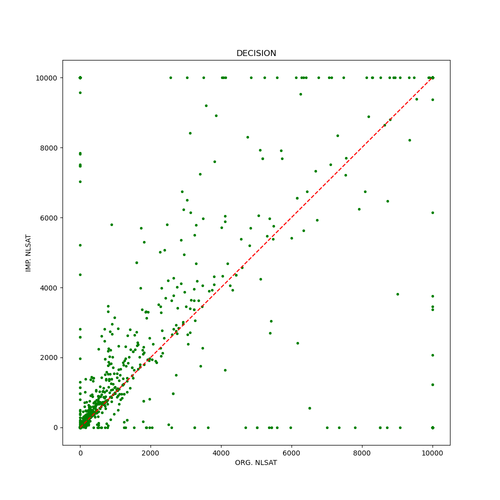
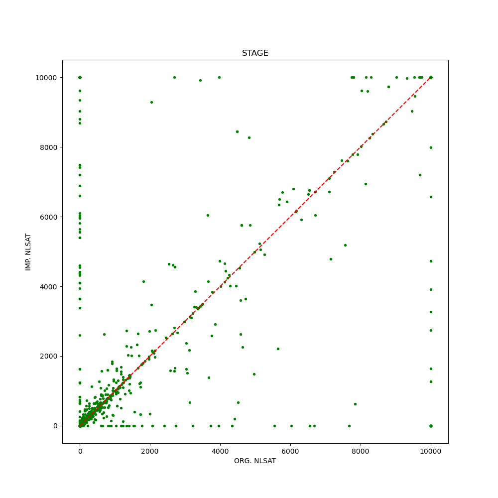

# Clause-Level MCSAT

## 目前焦点

在选择到path case之后，仍然需要decide literal，但是这个时候的decide是伪decide （任何一种选择不会产生path）。
z3原生产生子句后，会回退到decide层面的trail，然后尝试选择其他literal,这一点在cls-lvl可以避免。
问题是cls-lvl要回退到哪一层？

## Set Path for Arithmetic Variable

One-Level Path:

Two-Level Path:

## shortcut for unsat (只有一个变量)

当前process的clauses只还有一个变量(max var)，并且组成的satisfying interval为空集，直接返回unsat

## common case (仍然含有多个变量，此时应该怎么学习子句？)

目前做法：
在found decision之后，回退到block状态，然后继续尝试其他选择，以生成完整的多path下的lemma
undo_until_block()

## 第一版算法(with bug)

### Search:

### Conflict Analysis

这里主要有四种分类

- 布尔冲突
  - 之前有decide
  - 之前没有decide
- 算术冲突
  - 存在semantic decision
  - 不存在semantic decision （完全由arithmetic value造成）

此时应该对应四种算法，假定我们目前和z3一样，尝试回退到decision level，然后选择其他路径（虽然这在cls-lvl的做法中是不被提倡的）

1. 布尔冲突
   1. 之前有decide: 回退到decision level，然后尝试process clause
   2. 之前没有decide?
2. 算术冲突
   1. 存在semantic decision，此时的lemma应该含有一个decision literal，回退到decision level，然后process lemma，为了得到decision literal否定的赋值
   2. 不存在semantic decision，回退到stage，然后根据新的lemma从新计算clause-infeasible，继续path case和full case的分支

### Search with lemma:

当新的lemma生成之后，分两种情况

1. 之前是path case，用clause infeasible去计算和lemma的不可行区域union
   1. path case，赋值并继续search
   2. full case，重新process并回到resolve
2. 之前是full case

重新process并回到resolve

## 冲突分析时的几种情况

### only previous stage

var order: [x, y]
[x -> 4.5, !(x + 1 > 0), empty lemma]

### conflict is caused by curr decision

### conflict is not caused by curr decision, but still in curr stage

## 尝试解决allocation （运行一段时间后返回unknown）(done)

## 

2024.5.13

开启了clause decision之后一些instance有退步，寻找原因 (poly/cpr1)。

2024.5.14
一种可能是resolve花费了太长的时间，把resolve变成之前的之后，cpr1可以做到秒解。

2024.5.14
先不要尝试用原来的resolve，还是使用updated version，一个问题是resolve里面学习子句之后，process的顺序问题 （又或者说每次block case之后都涉及到的process顺序问题）。

比如
v3 = 2 or v3 = -2
v3 > 0
lemma: v3 != 2 or 4v4 >= 9
这个时候我们发现是block（考虑lemma和之前的clause infeasible），会优先decide v3 = 2
 **sort watched clauses by literals of max var occurance**

2024.5.15
测试一下conflict、decision和stage的个数，可以间接反应我们的算法的效率。
以及时间散点图。

/pub/data/wangzh/smt_benchmark/QF_NRA/hycomp/simple_ballistics_reach.01.seq_lazy_linear_enc_global_3.smt2 （cpr3）
这个例子origin用了0.2s，updated解不出来，而且只有6个arith和4个bool。

能不能考虑改进缓存机制
1. infeasible set的缓存 (second var)
5.16: 修复了bug，为search过程中的new atom register
2. reprocess的时候缓存（比如，不需要再重新loop一遍所有的literal）

# Versions
|Version|Description|
|-|-|
|5.13| simplest version no bug|
|5.14| disable cache, use original resolve|
|5.16| infeasible cache, resolve updated|
|-|-|

2024.5.17
调查一下decision的情况，为什么会出现退步。
一种猜想是由于witness导致的，我们能否不根据整体的feasible set来select witness，而是选择一个最靠前的路径？

现在的问题是如何通过clause infeasile来获取所有的feasible path。

example1:
x >= 0 \/ x <= -1.4
x <= 0 \/ x >= 1.4
clause feasible: (-oo, -1.4] U [1.4, +oo)

example2:
x <= 0 \/ x >= 43.64
x >= 6.64 \/ x >= 21.14
clause feasible: [43.64, +oo)

Theorem 0. Each witness in the clause's feasible set corresponds to a feasible path.

Theorem 1. if literal's feasible set intersects empty with clause's feasible set, then the literal is unsat. (x<=0 in Ex.2>)

Theorem 2. if literal's feasible set is a subset of clause's feasible set, then the literal is sat.

Try version using disabled witness path, but select witness from updt_infeasible set.
